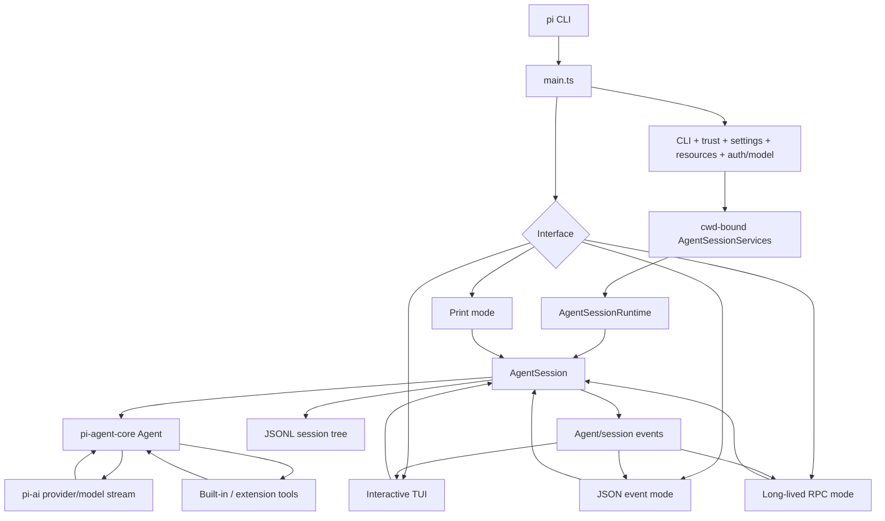

# Runtime flow

## CLI startup

The coding-agent process starts in `packages/coding-agent/src/main.ts`.

Startup resolves:

- CLI arguments and whether stdin/stdout are terminals;
- user and project settings;
- project trust and trust-gated resources;
- authentication/model selection;
- session selection or creation;
- cwd-bound services;
- extensions, skills, prompts, themes, tools, and context.

The runtime is then represented by an `AgentSessionRuntime`, which owns the current `AgentSession` and its services.

## Mode selection

The CLI selects a mode from the process context:

- explicit `--mode rpc` selects RPC;
- explicit JSON mode selects JSON events;
- `--print` or redirected input/output selects print behavior;
- otherwise a terminal-to-terminal invocation enters interactive mode.

These interfaces do not define separate agent implementations. They control how prompts enter the shared session engine, how events/results are exposed, and whether the process remains available.

## Building an AgentSession

Session services are created against the effective working directory. They resolve settings, resources, model/runtime state, authentication, trust, and session manager state.

The coding-agent session then wraps a lower-level `Agent`. The generic Agent owns the transcript and run lifecycle, while the coding-agent layer adds persistent entries, coding tools, compaction, extension hooks, and UI/session events.

## Prompt execution

A prompt enters the `Agent`, which starts the common agent loop.

The loop sends the current context to the selected model through `pi-ai`. Model output can contain assistant text and tool calls. Tools run through the configured tool set, their results enter the transcript, and the model can be called again until the run settles.

The Agent emits lifecycle events throughout. Coding-agent layers persist the relevant state and expose those events to the chosen mode.

## Interactive mode

Interactive mode owns the TUI and translates user editing, commands, pickers, and keyboard input into session operations.

The TUI is presentation/control state; the underlying AgentSession remains the authoritative agent/session engine.

## Print mode

Print mode runs supplied prompts, writes the final assistant text to stdout, then exits.

It is appropriate when a caller only needs the final answer. Intermediate agent lifecycle activity is deliberately not the interface.

## JSON mode

JSON mode runs one invocation and writes a session header plus newline-delimited session/agent events.

It exposes structured progress but does not accept later commands. `agent_settled`, rather than merely `agent_end`, marks the end of automatic work for the current run.

## RPC mode

RPC mode keeps the process alive. The caller writes JSONL commands to stdin and continuously reads command responses plus agent/session events from stdout.

A successful `prompt` response reports that the prompt was accepted/queued/handled; it does not mean work is complete. Clients that require completion continue consuming events until the run reaches settled state.

For TypeScript subprocess integrations, `RpcClient` wraps process management, request IDs, responses, and event subscriptions.

## SDK mode

The SDK constructs the same session machinery directly in a Node.js/Bun host process. It removes the process/protocol boundary and exposes direct TypeScript methods and events.

The repository documentation recommends SDK integration for in-process TypeScript hosts and RPC for language-independent or isolated-process hosts.

## Session changes

`AgentSessionRuntime` centralizes transitions such as:

- new session;
- resume/switch;
- fork;
- import.

Before replacement it settles/aborts active work as needed, emits session shutdown/switch hooks, disposes the old session, recreates services against the target cwd/session, and rebinds the new session.

## Runtime flow diagram

