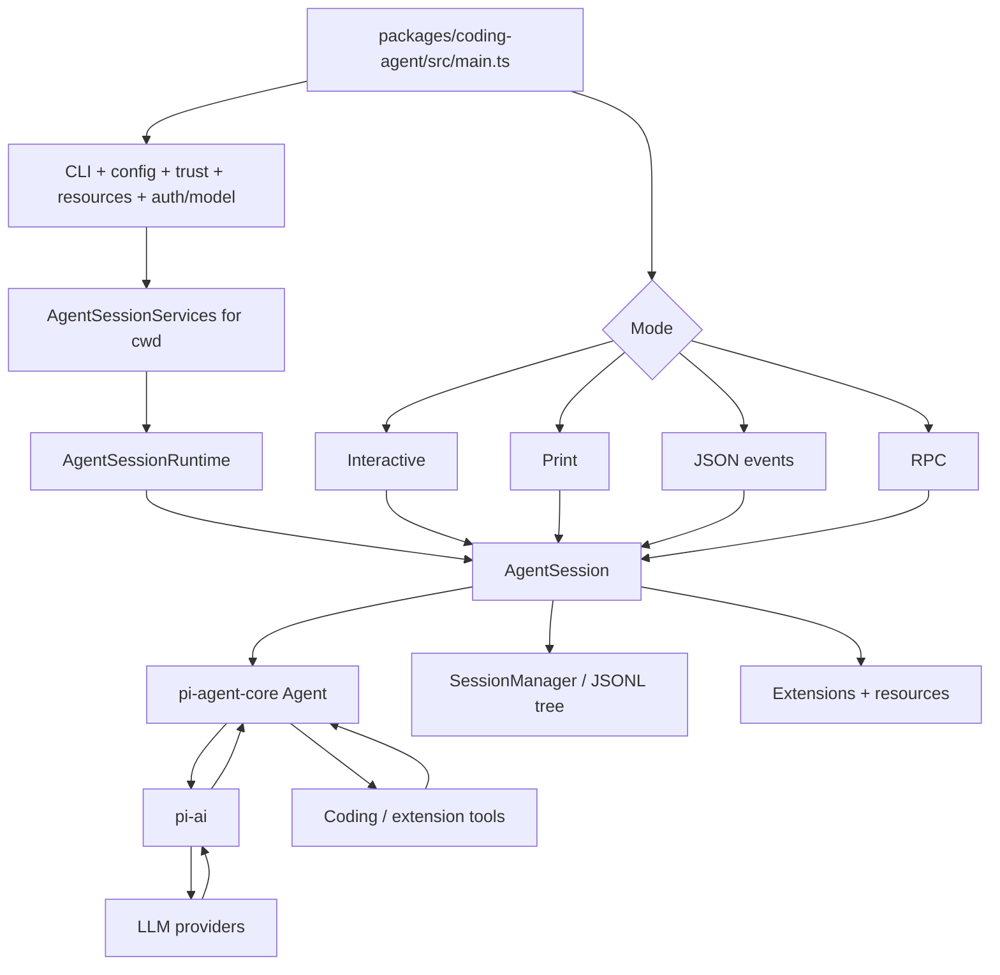
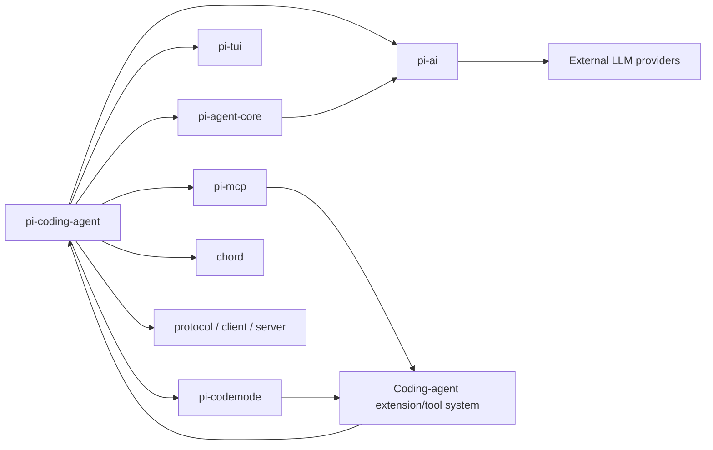
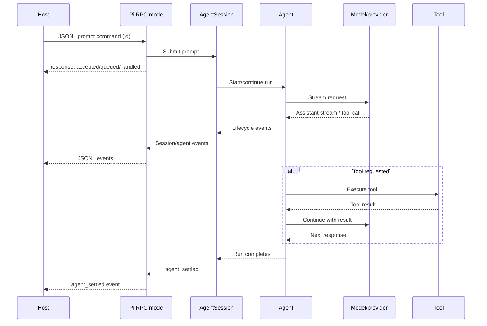
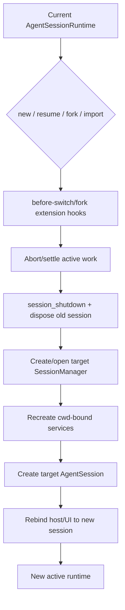
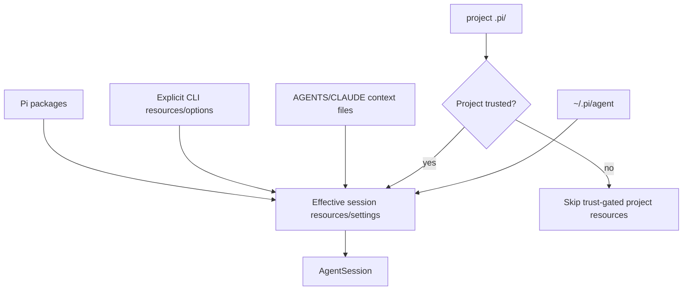

# Architecture diagrams

## 1. Coding-agent runtime

## 2. Monorepo interaction map

## 3. RPC prompt sequence

## 4. Session/runtime replacement

## 5. Configuration and resource boundaries

The diagrams intentionally separate the generic Agent, coding-agent session/runtime, interface modes, and persisted session tree. Those are distinct ownership boundaries even though the end-user experiences them as one `pi` process.
